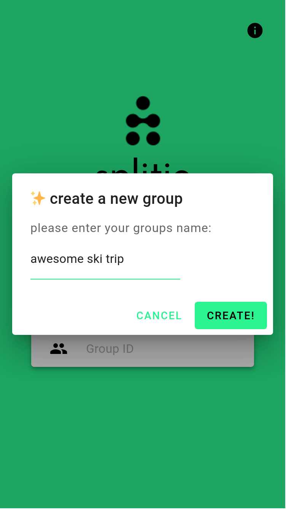
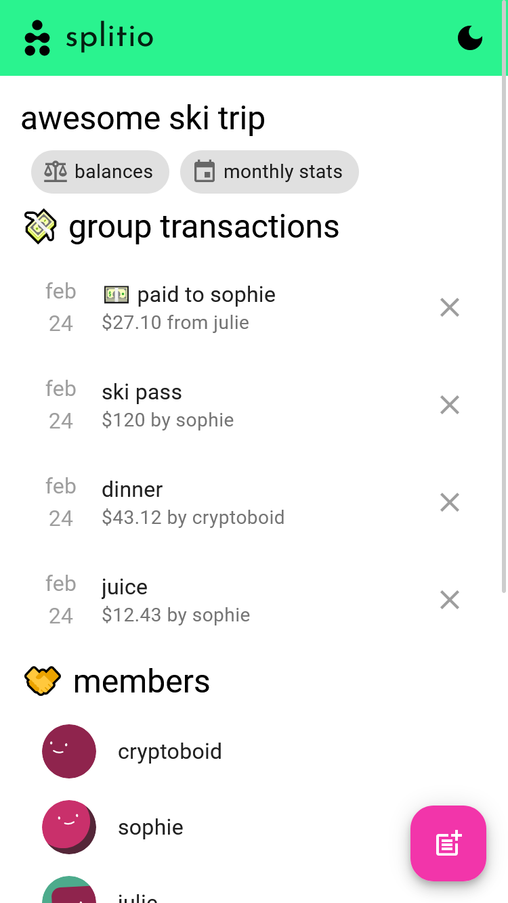
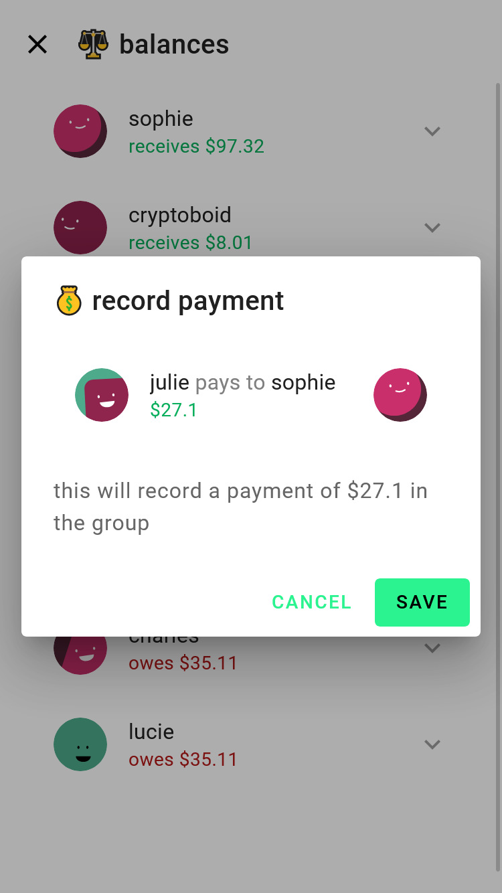
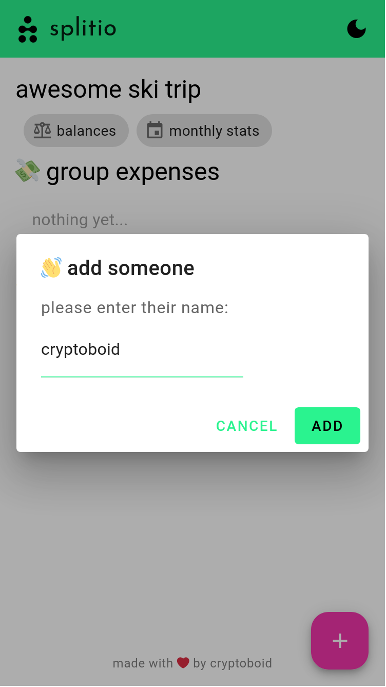
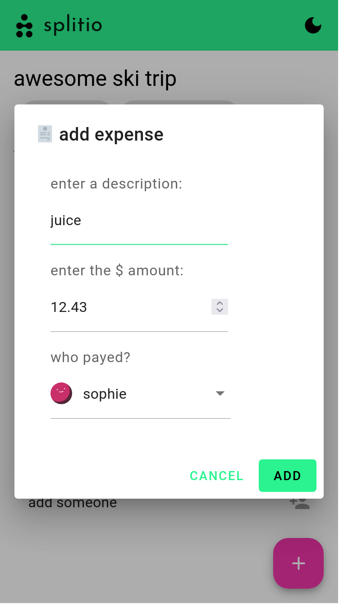
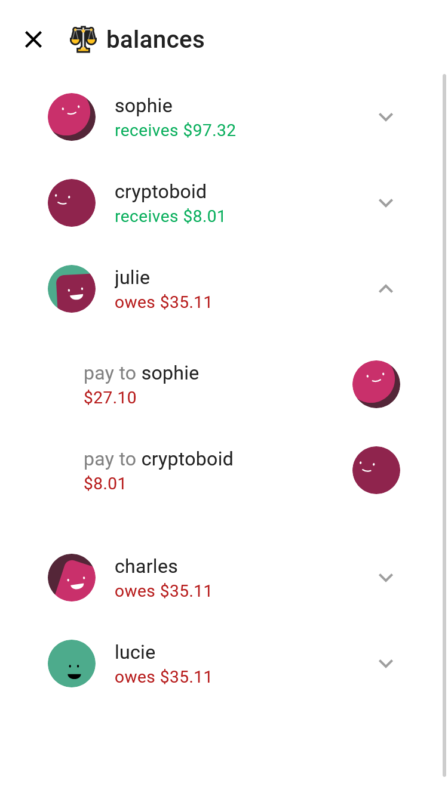

    
    <h1 align="center">splitio</h1>

  
  

split your bills easily! splitio is an open-source webapp built for tracking debts and
payments quickly, without any user accounts.

information is p2p distributed using gun and end-to-end encrypted using gun/sea.

built with SvelteKit and GunDB.

## 🌟 showcase
<table>
<tr>
    
    
    
    

</tr>
<tr>
    
    
    
</tr>
</table>

## 📝 next steps

some extra desired features/fixes are:
- compute who-owes-what
- add settlments
- calculate monthly stats (expenses amount in last 30 days)
- favorite a group for easy access in webapp (or provide shortcuts)

## ❤️ contribute

1. clone repo
2. install npm packages: `npm install`
3. start the server (with hot reloading): `npm run dev`
4. navigate to [localhost:5000](http://localhost:5000)

## ⚖️ license

MIT
